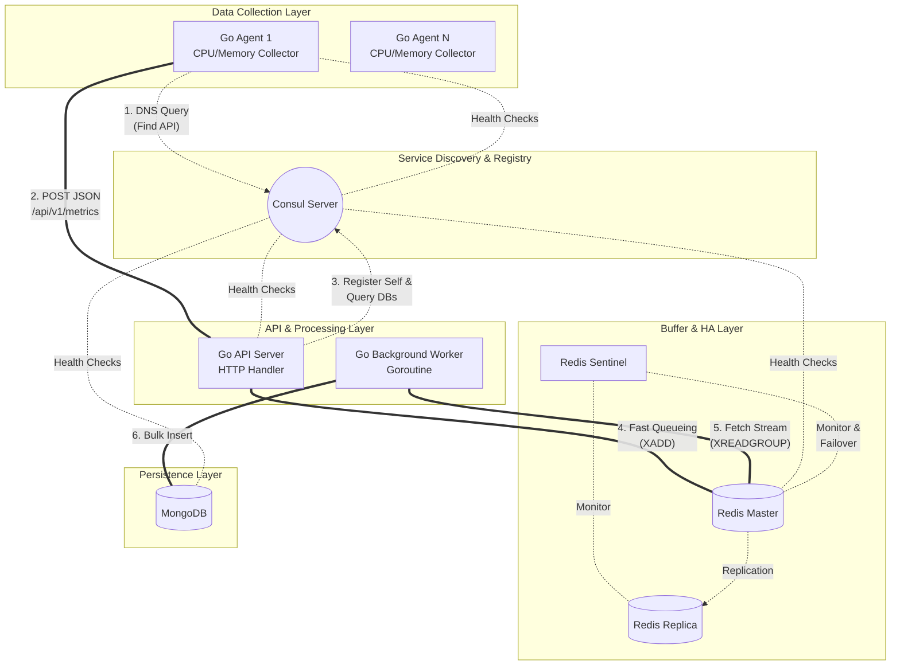

# Consulベース 分散型監視システム アーキテクチャ設計書

## 1. システム概要
本システムは、対象サーバーのリソース情報（CPU使用率、メモリ使用率）を収集し、動的なサービスディスカバリを用いてスケーラブルにデータを蓄積・永続化する監視システムである。
各コンポーネント間の連携は固定IPに依存せず、**Consul**を介した名前解決（Service Discovery）によって行われる。また、突発的なトラフィックのスパイクに耐えるため、**Redis Streams**を用いた非同期キューイングアーキテクチャを採用している。

## 2. アーキテクチャ構成図

## 3. コンポーネント定義と役割

### 3.1 メトリクス収集エージェント (Go Application)
* **役割:** 各監視対象サーバーに常駐し、定期的にシステムリソース（CPU/メモリ利用率）を収集する。
* **動作:** 起動時にConsulのDNS機能を利用してAPIサーバーのエンドポイントを解決する。収集したデータはJSON形式でAPIサーバーへPOST送信する。
* **拡張性:** Collectorインターフェースを実装しており、将来的なPingやHTTP死活監視の追加が容易な構造。

### 3.2 APIサーバー / アグリゲーター (Go Application)
* **役割:** エージェントからの大量のHTTPリクエストを受け止め、一時バッファへの書き込みと、永続化ストレージへのバッチ処理を担う。
* **動作 (HTTP層):** リクエストを受信後、即座にRedis Streamsに対してデータの書き込み(`XADD`)を行い、HTTP `200 OK` を返す（高速応答）。
* **動作 (Worker層):** メイン処理とは別のGoroutineで稼働。Redis Streamから未処理のデータを取得(`XREADGROUP`)し、MongoDBへ定期的に一括登録（Bulk Insert）を行う。完了後、RedisへACKを返す。

### 3.3 Consul (Service Registry / Discovery)
* **役割:** システム内のすべてのサービスの「電話帳」および「健康管理者」として機能する。
* **動作:** 各コンポーネントからのサービス登録を受け付ける。定期的なヘルスチェックを行い、異常のあるノードをルーティングの対象から自動的に除外する。

### 3.4 Redis + Redis Sentinel (In-Memory Data Store)
* **役割:** APIサーバーの応答速度を担保するための高速なメッセージキュー（バッファ）として機能する。
* **動作:** Redis Streamsデータ構造を利用し、時系列データを一時的に保持。Sentinelによってマスターノードのダウンを監視し、自動フェイルオーバー（レプリカの昇格）を行うことで高可用性(HA)を担保する。

### 3.5 MongoDB (Persistent Storage)
* **役割:** 収集されたメトリクスデータの最終的な保存先。
* **動作:** 時系列データの保存に適したドキュメント指向データベースとして機能。GoのWorkerからのBulk Insertを受け付け、将来的なデータ集計やダッシュボード表示の基盤となる。

## 4. データフロー（正常系）

1.  **エージェント起動:** ConsulへAPIサーバーのアドレスを問い合わせる。
2.  **データ収集:** エージェントが自身のCPU/メモリ使用率を取得。
3.  **データ送信:** エージェントがAPIサーバーへJSONペイロードを送信。
4.  **キューイング:** APIサーバーがデータを受け取り、Redis Streamに非同期で追加。即座にエージェントへレスポンスを返す。
5.  **データ取り出し:** バックグラウンドのWorkerがRedisからまとまった単位でデータを取得。
6.  **永続化:** WorkerがMongoDBに対してまとめてInsert処理を行う。
7.  **処理完了通知:** MongoDBへの保存成功後、WorkerがRedisに対して処理完了(ACK)を通知し、キューからタスクを消化する。