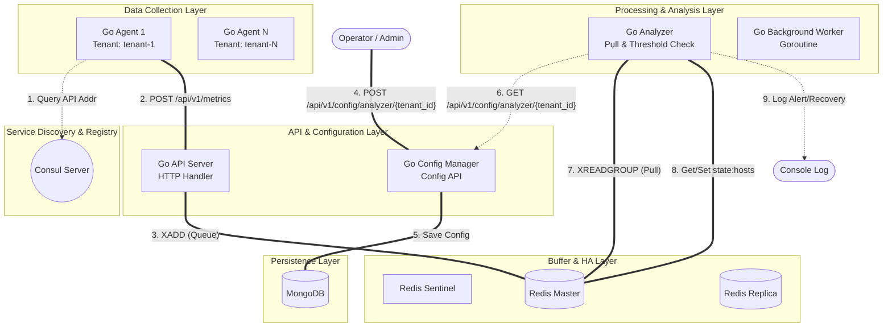

# Consulベース 分散型監視システム アーキテクチャ設計書

## 1. システム概要
本システムは、対象サーバーのリソース情報（CPU使用率、メモリ使用率）を収集し、動的なサービスディスカバリを用いてスケーラブルにデータを蓄積・永続化する監視システムである。
各コンポーネント間の連携は固定IPに依存せず、**Consul**を介した名前解決（Service Discovery）によって行われる。また、突発的なトラフィックのスパイクに耐えるため、**Redis Streams**を用いた非同期キューイングアーキテクチャを採用している。

## 2. アーキテクチャ構成図

```mermaid
graph TD
    subgraph "Data Collection Layer"
        Agent1[Go Agent 1<br/>Tenant: tenant-1]
        Agent2[Go Agent N<br/>Tenant: tenant-N]
    end

    subgraph "Service Discovery & Registry"
        Consul((Consul Server))
    end

    subgraph "API & Configuration Layer"
        API[Go API Server<br/>HTTP Handler]
        ConfigMgr[Go Config Manager<br/>Config API]
    end

    subgraph "Processing & Analysis Layer"
        Analyzer[Go Analyzer<br/>Pull & Threshold Check]
        Worker[Go Background Worker<br/>Goroutine]
    end

    subgraph "Buffer & HA Layer"
        Sentinel[Redis Sentinel]
        RedisM[(Redis Master)]
        RedisR[(Redis Replica)]
    end

    subgraph "Persistence Layer"
        Mongo[(MongoDB)]
    end

    %% Agent Flow
    Agent1 -. "1. Query API Addr" .-> Consul
    Agent1 == "2. POST /api/v1/metrics" === API
    
    %% API Flow
    API == "3. XADD (Queue)" === RedisM
    
    %% Config Flow
    User([Operator / Admin]) == "4. POST /api/v1/config/analyzer/{tenant_id}" === ConfigMgr
    ConfigMgr == "5. Save Config" === Mongo
    
    %% Analyzer Flow
    Analyzer -. "6. GET /api/v1/config/analyzer/{tenant_id}" .-> ConfigMgr
    Analyzer == "7. XREADGROUP (Pull)" === RedisM
    Analyzer == "8. Get/Set state:hosts" === RedisM
    Analyzer -. "9. Log Alert/Recovery" .-> Console([Console Log])
```

## 3. コンポーネント定義と役割

### 3.1 メトリクス収集エージェント (Go Application)
* **役割:** 各監視対象サーバーに常駐し、定期的にシステムリソース（CPU/メモリ利用率）を収集する。
* **動作:** 起動時に環境変数からテナントID (`tenant_id`) を読み込む。ConsulのDNS機能（またはヘルスチェックAPI）を利用してAPIサーバーのエンドポイントを解決する。収集したデータは、テナントIDを含めてJSON形式でAPIサーバーへPOST送信する。

### 3.2 APIサーバー / アグリゲーター (Go Application)
* **役割:** エージェントからの大量のHTTPリクエストを受け止め、一時バッファ（Redis Streams）への高速な書き込みを担う。
* **動作:** リクエストを受信後、即座にRedis Streamsに対してデータの書き込み(`XADD`)を行い、HTTP `200 OK` を返す。

### 3.3 Consul (Service Registry / Discovery)
* **役割:** システム内のすべてのサービスの「電話帳」および「健康管理者」として機能する。
* **動作:** 各コンポーネントからのサービス登録を受け付ける。定期的なヘルスチェックを行い、異常のあるノードをルーティングの対象から自動的に除外する。

### 3.4 Redis + Redis Sentinel (In-Memory Data Store)
* **役割:** APIサーバーの応答速度を担保するための高速なメッセージキュー（バッファ）およびホストの状態管理データベースとして機能する。
* **動作:** Redis Streamsデータ構造を利用し、時系列データを一時的に保持。Sentinelによってマスターノードのダウンを監視し、自動フェイルオーバーを行う。また、ハッシュ `state:hosts` にてホストごとの監視状態（正常/異常）を保持する。

### 3.5 MongoDB (Persistent Storage)
* **役割:** 収集されたメトリクスデータの最終的な保存先、および設定データの永続化先。
* **動作:** GoのWorkerからのBulk Insertを受け付けるほか、Config Manager からのテナントごとの閾値設定（`configs` コレクション）を永続化する。

### 3.6 Config Manager (Go Application)
* **役割:** 各コンポーネントの設定（Analyzer の閾値設定、Ping 監視パラメータ、収集頻度など）を一元管理する API サーバー。
* **動作:** テナント別の設定を受け付ける REST API (`/api/v1/config/analyzer/{tenant_id}`) を提供し、設定情報を MongoDB に保存・取得する。古い設定ドキュメントに対するデフォルト値マージ（後方互換）の役割も担う。自身を Consul に登録して他コンポーネントから発見可能にする。

### 3.7 Analyzer (Go Application)
* **役割:** 収集されたリソースメトリクスおよび Ping 疎通結果をリアルタイムに解析し、閾値超過や接続断を検知して通知する。
* **動作:** Redis Streams からデータを Pull し、該当テナントの設定を Config Manager から取得（メモリキャッシュ併用、未設定パラメータはデフォルト補完）。前回の状態と今回の状態を比較し、リソース使用率の超過または Ping ロスト数判定に基づき、正常 ⇄ 異常の遷移（ヒステリシス考慮）が発生した時のみログ通知を出力し、最新状態を Redis (`state:hosts`) に保存する。

## 4. データフロー（正常系および設定・解析）

### 4.1 設定登録フロー
1.  **設定送信:** 管理者が Config Manager に対して特定のテナントの設定（エラー閾値・復帰閾値・Ping 測定数・タイムアウトなど）を送信。
2.  **設定保存:** Config Manager が MongoDB に対して設定をアップサートする。

### 4.2 監視・解析データフロー
1.  **エージェント起動:** Consul を介して API サーバーのアドレスを解決する。環境変数からテナントIDおよび Ping 対象ホストリスト (`PING_TARGETS`) を読み込む。
2.  **設定同期:** エージェントが Config Manager から最新の設定（収集間隔、Ping 送信数、間隔、タイムアウト）を定期的に同期する。
3.  **データ送信:** エージェントが自身の CPU/メモリ使用率の収集と指定ホストへの Ping 測定を行い、テナントIDとともに API サーバーへ JSON を POST 送信。
4.  **キューイング:** API サーバーがデータを受け取り、即座に Redis Streams (`metrics_stream`) に追加して HTTP 200 を返す。
5.  **解析データ取得:** Analyzer が Redis Streams から `XREADGROUP` で未処理のメトリクスを Pull する。
6.  **設定同期:** Analyzer が該当テナントの設定を Config Manager から取得（10秒キャッシュ、デフォルト補完適用）。
7.  **状態判定:** 設定された閾値とメトリクス（CPU/メモリ/Pingロスト数）を比較し、状態遷移（正常 ⇄ 異常）を判定する。
8.  **通知・記録:** 状態遷移が発生した場合、コンソールログに通知を出力し、新しい状態を Redis の `state:hosts` に保存する。
9.  **処理完了:** 処理完了後、Analyzer が Redis に対して処理完了(ACK)を通知する。

---

## 5. 設定スキーマ仕様

Config Manager が管理し、各コンポーネントが同期するテナント別のパラメータ定義は以下の通り。

| キー名 | 型 | デフォルト値 | 有効範囲 | 説明 |
|---|---|---|---|---|
| `cpu_error_threshold` | float | 80.0 | 0.1 - 100.0 | CPU使用率エラーしきい値 (%) |
| `cpu_recovery_threshold` | float | 70.0 | 0.1 - 100.0 | CPU使用率復帰しきい値 (%) (エラーしきい値未満) |
| `memory_error_threshold` | float | 80.0 | 0.1 - 100.0 | メモリ使用率エラーしきい値 (%) |
| `memory_recovery_threshold` | float | 70.0 | 0.1 - 100.0 | メモリ使用率復帰しきい値 (%) (エラーしきい値未満) |
| `ping_count` | int | 5 | 1 - 20 | Ping 送信パケット回数 |
| `ping_interval_ms` | int | 1000 | 100 - 5000 | パケット送信のインターバル (ミリ秒) |
| `ping_timeout_ms` | int | 1000 | 100 - 5000 | パケット応答待ちのタイムアウト時間 (ミリ秒) |
| `collect_interval_seconds` | int | 5 | 2 - 300 | エージェントの収集・送信間隔 (秒) |
| `ping_error_lost_threshold` | int | 3 | 1 - `ping_count` | エラーと判定するロストパケット数しきい値 |