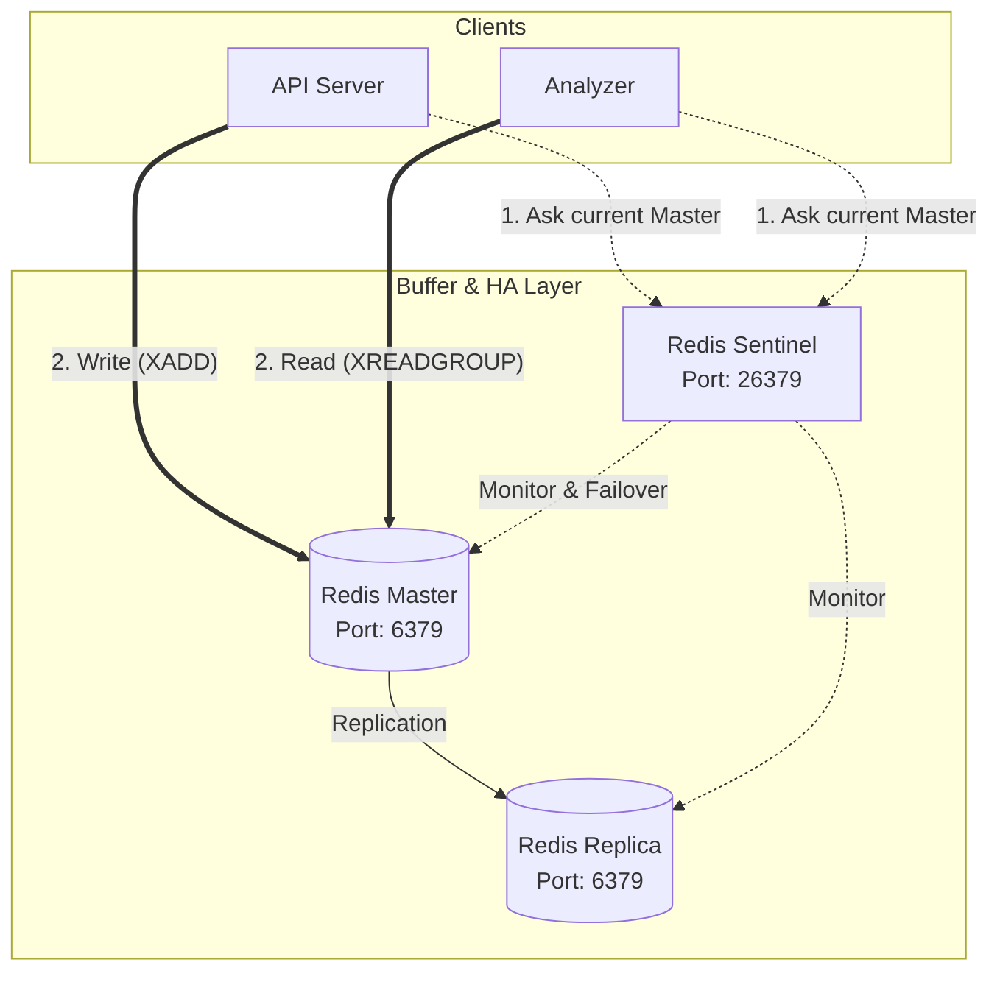

# Redis システム構成およびキューイング仕様書

本ドキュメントは、監視システムにおける **Redis** の役割、システム構成（高可用性）、および **Redis Streams** を使用した非同期メッセージキューイングの仕様についてまとめたものである。

---

## 1. Redis システム構成（高可用性）

本監視システムでは、API サーバーの応答速度担保と耐障害性を向上させるため、**Redis Sentinel（マスター/レプリカ）構成**を採用している。



### 1-1. コンポーネントと役割
*   **`redis-master`**: メトリクスの書き込み (`XADD`) や状態の更新を行う、プライマリ（書き込み可能）ノード。
*   **`redis-replica`**: マスターのデータをリアルタイムに複製する、セカンダリ（読み取り専用）ノード。
*   **`redis-sentinel`**: マスターおよびレプリカの死活状態を監視し、マスターがダウンした際にレプリカを新しいマスターに自動昇格（自動フェイルオーバー）させる監視プロセス。

### 1-2. クライアントの接続追従ロジック
API サーバーおよび Analyzer は、プログラムの起動時に Sentinel（`26379` ポート）へ接続し、現在のマスターノードの IP アドレスを問い合わせて接続を確立する。
これにより、フェイルオーバーが実行されてマスターが入れ替わった場合も、クライアントは自動的に新しいマスターへ接続を切り替えることができるため、システム全体のダウンタイムを最小限に抑えることができる。

---

## 2. Redis Streams を用いた非同期キューイング

エージェントから送信される大量のメトリクスを安全にバッファリングするため、Redis の **Streams** データ構造を採用している。

### 2-1. 技術選定の理由 (Streams のメリット)
*   **時系列ログの永続化**: 通常の Pub/Sub とは異なり、メッセージを受信側がその場で受け取れなくても、データがログとしてメモリ上（および AOF 経由でディスク）に残り続ける。
*   **コンシューマグループ機能**: 同一グループ内のコンシューマ間でメッセージを重複なく分散処理（ロードバランス）でき、Analyzer の複数起動（スケールアウト）に標準で対応可能。
*   **確実な到達性 (ACK 管理)**: メッセージを処理した後に完了通知 (`XACK`) を送ることでキューから消化されるため、Analyzer が処理の途中でクラッシュした場合も、未処理のメッセージを安全に再処理できる。

### 2-2. ストリーム構造の仕様
*   **ストリーム名**: `metrics_stream`
*   **メッセージ構造 (JSONB形式)**:
    データは `data` という単一のフィールドの中に、エージェントから送られたメトリクス JSON 文字列として格納される。
    ```text
    Key: metrics_stream
    └─ MessageID (例: 1716301234567-0)
       └─ Field "data" = "{\"tenant_id\":\"tenant-1\",\"host_id\":\"host-01\",\"cpu_usage\":4.5,\"memory_usage\":28.1}"
    ```

### 2-3. コンシューマグループの設計
*   **コンシューマグループ名**: `metrics_group`
*   **コンシューマ名**: `analyzer_consumer`
*   **メッセージ処理フロー**:
    1.  **データ追加 (API Server)**: 
        API サーバーが受信データを `XADD metrics_stream * data <JSON>` でストリームへ追加する。
    2.  **データ取得 (Analyzer)**: 
        Analyzer が `XREADGROUP GROUP metrics_group analyzer_consumer STREAMS metrics_stream >` を使って、未処理のメッセージ（`>`）を Pull する。
    3.  **処理完了通知 (Analyzer)**: 
        データの判定が正常に終了した時点で、`XACK metrics_stream metrics_group <MessageID>` を送信し、保留中リスト（PEL: Pending Entries List）から削除する。

---

## 3. ホスト状態の管理 (State Store)

Analyzer がホストごとの「前回判定した状態」を保持し、通常 ⇄ 異常の遷移を正しく判定するため、Redis の **Hashes** データ構造を利用している。

### 3-1. ハッシュのデータ構造仕様
*   **キー名**: `state:hosts`
*   **フィールド名**: `{tenant_id}:{host_id}` （テナント名とホスト名をコロンで結合し、マルチテナント間の衝突を防止）
*   **値**: `"Normal"`（正常） または `"Alert"`（異常）
    ```text
    Key: state:hosts (Hashes)
    ├─ "tenant-1:host-01" -> "Normal"
    ├─ "tenant-1:host-02" -> "Alert"
    └─ "tenant-2:host-01" -> "Normal"
    ```

### 3-2. 選定理由
メモリ上でホストごとの状態を O(1) で高速に読み書き (`HGET` / `HSET`) でき、かつ Analyzer がクラッシュ・再起動しても、他のノードから状態を復旧できるステートレス設計を実現するため。

---

## 4. 運用・デバッグ用 Redis コマンド集

システムのデバッグや調査時に役立つ `redis-cli` コマンド。

### 4-1. Sentinel（高可用性）の調査
```bash
# 現在の Master ノードの IP/Port を取得する
docker exec -it redis-sentinel redis-cli -p 26379 sentinel get-master-addr-by-name mymaster

# レプリカ（スレーブ）ノードの一覧を取得する
docker exec -it redis-sentinel redis-cli -p 26379 sentinel replicas mymaster
```

### 4-2. Streams（メッセージキュー）の調査
```bash
# ストリームの基本情報（メッセージ数やコンシューマグループ数）を確認する
docker exec -it redis-master redis-cli xinfo stream metrics_stream

# コンシューマグループの一覧と保留中のメッセージ数を確認する
docker exec -it redis-master redis-cli xinfo groups metrics_stream

# 登録されているメッセージの一覧を範囲指定で取得する
docker exec -it redis-master redis-cli xrange metrics_stream - +

# 登録されているメッセージ数を取得する
docker exec -it redis-master redis-cli xlen metrics_stream
```

### 4-3. ハッシュ（状態管理）の調査
```bash
# 全てのホストと現在の状態のペアを取得する
docker exec -it redis-master redis-cli hgetall state:hosts

# 特定のホストの状態のみを取得する
docker exec -it redis-master redis-cli hget state:hosts tenant-1:host-01
```
